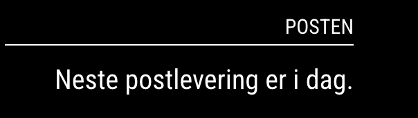

# MMM-PostenDelivery
A MagicMirror module to display the next postal delivery date from Posten.no

Features
- Shows the next postal delivery date using terms like "today", "tomorrow", etc.
- Simple setup with a provided postal code.
   

### Screenshot




### Installation
Prerequisites

1. MagicMirror²: Make sure you have MagicMirror² installed. Follow the official installation guide
2. Python 3: Ensure Python 3 is installed on your system. You can verify this by running:
   
```
python3 --version
```
3. aiohttp: This Python library is required for making asynchronous HTTP requests.
```
pip3 install aiohttp
```


### Step-by-Step Installation
1. Clone the Repository
 - Navigate to your MagicMirror modules directory and clone the repository:
```
cd ~/MagicMirror/modules
git clone https://github.com/kurtern84/MMM-PostenDelivery.git

```
2. Navigate to the Module Directory
```
cd MMM-PostenDelivery
```
3. Install Node Dependencies
```
npm install
```
4. Configure the Module
 - Open your config/config.js file and add the module configuration. Example configuration:
```js
{
    module: "MMM-PostenDelivery",
    position: "top_right", // Choose your preferred position
    config: {
        postalCode: "2850" // Your postal code
    }
}
```
5. Verify Python Script Path
 - Ensure posten_api_client.py is located in the MMM-PostenDelivery directory.

### Usage
- Once the module is configured, restart MagicMirror to see the module in action.
- The module will display the next postal delivery date based on your configured postal code.

### Troubleshooting
- Blank Screen/Error Messages: Check the MagicMirror logs for any errors.
```bash
pm2 logs MagicMirror
```
- Python Dependencies: Ensure aiohttp is installed. If not, install it using:
```bash
pip3 install aiohttp
```
- Permission Issues: Ensure that the script has execution permissions:
```bash
chmod +x posten_api_client.py
```

### Development
Feel free to contribute to this project by forking the repository and creating pull requests.

### License
This project is licensed under the MIT License. See the LICENSE file for details.

### Contact
For any issues or questions, feel free to open an issue on GitHub.
